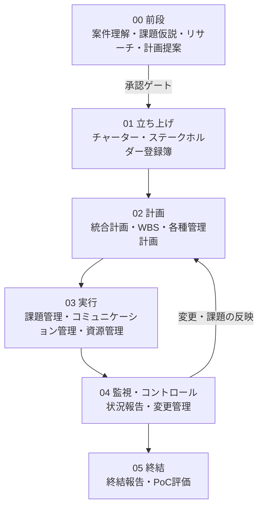

# AIプロジェクトリーダー

**生成AI/DX案件を、PMBOK第8版ベースで入口から終結まで伴走するためのSkill群とナレッジ基盤。**

クライアントが「AIで何かできないか」としか言えない段階から、案件理解、課題仮説、提案、立ち上げ、計画、実行、監視、終結までを一気通貫で支援します。

このプロジェクトは、AIにプロジェクト運営を丸投げする仕組みではありません。AIが構造化・壁打ち・停止確認を担い、**プロジェクトマネージャー本人の判断力と説明力を底上げする**ことを目的にしています。

| | |
|---|---|
| 準拠フレーム | PMBOK第8版（6原則・7ドメイン・40プロセス） |
| 運用Skill | 31（前段・立ち上げ・計画・実行・監視・終結・横断） |
| メタSkill | 2（Skill作成支援・壁打ちキックオフ） |
| パッケージ | 33 `.skill` |
| 回帰テスト | 38件（ゴールデン + LLM-judge） |
| 模擬完走 | 4案件で全フェーズ検証済み |

---

## 何ができるか

- 曖昧な商談メモや議事録を、案件理解サマリーに構造化する
- 課題仮説、リサーチメモ、計画提案書まで前段をつなげる
- 承認済みの前段成果物から、チャーター、統合計画、WBS、各種管理計画へ進める
- 実行中の課題、変更、週次状況、終結報告をPMBOKの観点で整理する
- 案件規模に応じて成果物をテーラリングし、「作る / 省く」の判断理由を残す

向いているのは、生成AI活用支援、AIエージェント開発、業務のAI Native化のように、顧客課題の整理から提案・実装・定着までをつなぐDX/コンサル案件です。特に「何をAI化すべきか」「どう要求を切り出し、どの順番で形にするか」がまだ曖昧な初期状態を、PMが説明可能な計画へ引き上げる場面を想定しています。

---

## 設計思想

### 1. おまかせ不採用

AIが裏で勝手に進めません。今どのフェーズ・どのドメインで・なぜこの成果物を作るのかを示し、重要な分岐では必ず人間が確認します。

### 2. 1成果物 = 1 Skill

案件理解サマリー、課題仮説シート、プロジェクトチャーター、WBS、リスク管理計画など、成果物ごとに独立したSkillを持ちます。親Skill（chain）は順番・受け渡し・停止ポイントだけを管理します。

### 3. テーラリング前提

PMBOK第8版の40プロセスを毎回すべて実行するのではなく、案件の規模・不確実性・関係者数・リスクに応じて必要な成果物を選びます。

---

## 5分クイックスタート

新しい案件を試すときは、まず次のどれかをAIに渡します。

- 初回商談メモ
- 議事録
- 提案前の相談内容
- スライド/PDFの要約

最初の依頼文:

```text
前段チェーンを回して。以下の案件説明から、案件理解サマリー、課題仮説、必要ならリサーチ、計画提案書まで順に進めたいです。
```

進み方:

1. AIが `00_前段/01_案件理解サマリー` を作る
2. **「この理解で合っていますか？」で必ず止まる**
3. 確認後、`02_課題仮説シート` → `03_リサーチメモ` → `04_計画提案書` へ進む
4. 計画提案書の承認後、引き継ぎ書を作って立ち上げフェーズへ

各工程で止まり、PMが確認して進みます。AIは提案と理由を見せる役割です。

---

## 起動文の例

| やりたいこと | 依頼文 |
|---|---|
| 新規案件を入口から整理 | `前段チェーンを回して` |
| 商談メモを案件理解へ | `この初回商談メモから案件理解サマリーを作って` |
| 課題仮説を作る | `承認済みの案件理解サマリーから課題仮説シートを作って` |
| 提案に向けた裏取り | `この課題仮説をもとにリサーチメモを作って` |
| 計画提案書へまとめる | `前段成果物をもとに計画提案書にまとめて` |
| 立ち上げへ進む | `引き継ぎ書を受けて立ち上げフェーズを回して` |
| 設計や決定を詰めたい | `grill-meして` |

---

## 全フェーズの流れ



---

## フォルダ構成

```text
AIプロジェクトリーダー/
├── README.md                       # GitHub向け入口
├── AGENTS.md / CODEX.md / CLAUDE.md # AIエージェント向け作業規約
├── プロジェクト骨子.md              # 設計思想・原則の正典
├── 00_プロジェクト管理/             # 決定事項・懸念・接続規約・配布方針
├── 10_参考資料/                    # PMBOK基準資料・参考資料（配布除外を含む）
├── 20_Skills/                      # Skill本体
│   ├── 00_前段/                    # zendan-chain と前段4成果物
│   ├── 01_立ち上げ/                # チャーター、ステークホルダー登録簿
│   ├── 02_計画/                    # 統合計画、WBS、管理計画群、PoC提案
│   ├── 03_実行/                    # 課題管理、コミュニケーション、資源管理
│   ├── 04_監視コントロール/         # 状況報告、変更管理
│   ├── 05_終結/                    # 終結報告、PoC評価
│   ├── 90_横断/                    # grill-me、業務フロー設計
│   └── 99_メタ/                    # Skill作成支援
├── 30_Flow/                        # 案件ごとの作業フォルダ
├── 40_Stock/                       # 横断ガイドライン・ナレッジ・テンプレート
├── 50_サンプル成果物/              # docx / pptx / xlsx サンプル
├── 90_横断/                        # 横断支援の配置先
└── _tools/                         # ビルド・同期・eval・配布検証
```

Flow＝作業中、Stock＝完成品。この分離で「何が途中で、何が再利用可能か」を見失わないようにしています。

---

## 知っておくと迷わない場所

| 用途 | 場所 |
|---|---|
| 全体思想・ロードマップ | [`プロジェクト骨子.md`](プロジェクト骨子.md) |
| 成果物とSkillの対応表 | [`20_Skills/成果物マップ.md`](20_Skills/成果物マップ.md) |
| 案件フォルダの命名規約 | [`30_Flow/README.md`](30_Flow/README.md) |
| 文章・図・表の共通ルール | [`40_Stock/横断ガイドライン/`](40_Stock/横断ガイドライン/) |
| PMBOK基準資料 | [`10_参考資料/PMBOK第8版_40プロセス一覧.md`](10_参考資料/PMBOK第8版_40プロセス一覧.md) |
| 懸念と残タスク | [`00_プロジェクト管理/構造レビュー/懸念マスター.md`](00_プロジェクト管理/構造レビュー/懸念マスター.md) |
| Codex作業ルール | [`CODEX.md`](CODEX.md) |

---

## 検証・ビルド

構造健全性:

```bash
bash _tools/build.sh --verify
```

共通referencesのドリフト確認:

```bash
bash _tools/build.sh --check
```

成果物の回帰eval:

```bash
bash _tools/eval.sh
```

Skillのパッケージ化は手作業zipではなく、必ず `_tools/build.sh` を使います。

```bash
bash _tools/build.sh --all
```

---

## 配布とデータ取り扱い

- `20_Skills/` が配布物の中心です。
- `10_参考資料/` には著作物・参考資料が含まれるため、配布時は除外対象を確認します。
- 実案件データは `30_Flow/` 内に置き、`40_Stock/` や配布物へ移す場合は脱識別します。
- 客先提出版に内部用の検査レシートや管理メタをそのまま混ぜません。

詳細は [`00_プロジェクト管理/配布と雛形化_層の定義と棚卸し.md`](00_プロジェクト管理/配布と雛形化_層の定義と棚卸し.md) を参照してください。

---

## 現在のステータス

- 全フェーズの主要Skillとchainは作成済み
- 模擬4案件で end-to-end 完走済み
- 回帰evalとLLM-judgeの基盤は稼働済み
- Claude Code / Codex対応、Hooks強制、CI化、ポータビリティ検証は後続フェーズ

---

## ライセンス

現時点ではライセンス未定です。利用・再配布の扱いはリポジトリ所有者に確認してください。

---

## 作者

PMBOKを共通言語に、生成AIと協働してプロジェクトを完走させる仕組みを個人で設計・構築しています。曖昧な期待を、説明可能な計画と実行管理へ変えるための実務基盤です。
